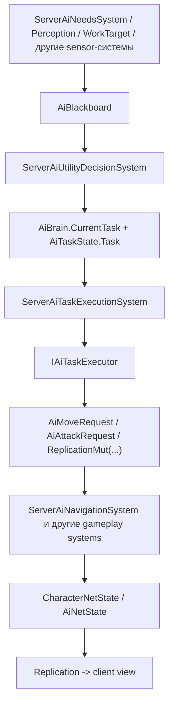
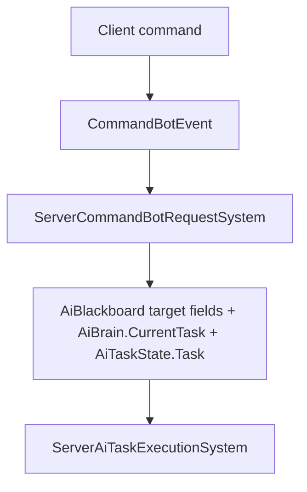

# AiBots: расширение новых Action

Этот документ описывает, как в текущем проекте расширять `AiBots` новыми `Action`.

В текущей реализации `Action` бота фактически представлен через `AiTaskType`. Дальше он проходит через два слоя:

- `StaticMlp.Features.AiBots`: выбор задачи, blackboard, perception, utility, сетевые команды.
- `StaticMlp.Features.AiTaskExecution`: исполнение выбранной задачи через `IAiTaskExecutor`.

## Быстрая карта ответственности

- `Assets/Scripts/StaticMlp/Features/AiBots/Runtime/Components/AiTaskType.cs`
  Здесь объявляется новый тип действия.
- `Assets/Scripts/StaticMlp/Features/AiBots/Runtime/Domain/AiBehaviorCatalogDefaults.cs`
  Здесь action подключается в utility-выбор поведения.
- `Assets/Scripts/StaticMlp/Features/AiBots/Runtime/Components/AiBlackboard.cs`
  Здесь живут входные данные для выбора и выполнения action.
- `Assets/Scripts/StaticMlp/Features/AiBots/Runtime/Systems/Server/*`
  Здесь blackboard наполняется актуальными данными на сервере.
- `Assets/Scripts/StaticMlp/Features/AiTaskExecution/Runtime/Execution/Executors/*`
  Здесь находится логика конкретного action.
- `Assets/Scripts/StaticMlp/Features/AiTaskExecution/Runtime/Systems/Server/ServerAiTaskExecutionSystem.cs`
  Здесь новый executor регистрируется в runtime.
- `Assets/Scripts/StaticMlp/Features/AiBots/Runtime/Systems/Server/ServerCommandBotRequestSystem.cs`
  Здесь action становится доступен для ручной команды игрока, если это нужно.
- `Assets/Scripts/StaticMlp/Features/AiBots/Runtime/Systems/Server/ServerAiNetStateSystem.cs`
  Здесь на клиент уходит сжатое состояние AI для визуализации.

## Базовый DataFlow



Если action задаётся игроком вручную, перед utility-слоем появляется ещё одна ветка:



## Как добавить новый Action

### 1. Добавить значение в `AiTaskType`

Добавьте новый элемент в `AiTaskType`.

Пример:

```csharp
public enum AiTaskType : ushort
{
    Idle = 0,
    GatherWood = 1,
    Eat = 2,
    AttackEnemy = 3,
    Flee = 4,
    FollowLeader = 5,
    BuildConstruction = 6,
    RepairConstruction = 7
}
```

Если action должен реплицироваться на клиент как текущая задача, этого уже достаточно: `AiNetState.CurrentTask` сериализует `AiTaskType` как `ushort`.

### 2. Определить, какие данные нужны action

Сначала ответьте на два вопроса:

- Что нужно для выбора action?
- Что нужно для выполнения action?

Если новому action нужны новые входы, расширяйте `AiBlackboard`.

Примеры текущих полей:

- `Enemy`
- `Leader`
- `WorkTarget`
- `LastKnownEnemyPosition`
- `Hunger`
- `Fear`

Если новый action должен участвовать в utility-оценке через новый сигнал, обычно нужно:

1. Добавить поле в `AiBlackboard`.
2. Добавить ключ в `AiBlackboardKey`.
3. Научить `AiUtilityEvaluator.ReadBlackboardValue(...)` читать этот ключ.
4. Наполнить это поле в одном из server systems или в новом server system.

Если данные нужны только executor-у и не участвуют в utility, достаточно нового поля в `AiBlackboard` и системы, которая его обновляет.

### 3. Наполнить blackboard на сервере

`AiBlackboard` должен заполняться отдельными server systems, а не из executor-а.

Текущие примеры:

- `ServerAiNeedsSystem` обновляет внутренние потребности.
- `ServerAiPerceptionSystem` пишет врага, дистанцию, страх.
- `ServerAiWorkTargetSystem` подбирает рабочую цель.

Если для нового action нужен новый источник данных, добавьте новый системный шаг в `AiBotsGameplayFeature.RegisterServerSystems(...)`.

Важно:

- не ходить напрямую в transport;
- не хранить `Entity` между кадрами;
- сохранять длительные ссылки через `EntityGID`;
- если данные обязательны для работы action, лучше падать явно, чем молча пропускать ошибку.

### 4. Подключить action к utility-выбору

Если action должен выбираться ботом автономно, добавьте `UtilityTaskDefinition` в нужное поведение внутри `AiBehaviorCatalogDefaults.Create()`.

Там задаются:

- `Task`
- набор `UtilityConsideration`
- веса и curve для каждого сигнала

Если action не должен выбираться автоматически, этот шаг можно пропустить и оставить action только для внешней команды или для другого системного триггера.

### 5. Создать executor

Новый executor создаётся в `StaticMlp.Features.AiTaskExecution`, обычно в папке:

`Assets/Scripts/StaticMlp/Features/AiTaskExecution/Runtime/Execution/Executors/`

Шаблон:

```csharp
internal sealed class RepairConstructionAiTaskExecutor : AiTaskExecutorBase
{
    private readonly AiTaskExecutionTransitions _transitions;

    public RepairConstructionAiTaskExecutor(AiTaskExecutionTransitions transitions)
    {
        _transitions = transitions;
    }

    public override AiTaskType TaskType => AiTaskType.RepairConstruction;

    public override void Enter(SW.Entity entity, ref AiTaskState task, ref AiBlackboard blackboard)
    {
    }

    public override void Execute(SW.Entity entity, ref AiTaskState task, ref AiBlackboard blackboard)
    {
        task.Timer += Time.deltaTime;
    }

    public override void Exit(SW.Entity entity, ref AiTaskState task, ref AiBlackboard blackboard)
    {
    }
}
```

Правила для executor-а:

- executor работает только на сервере;
- executor не должен писать в transport;
- movement лучше выражать через `AiMoveRequest`;
- боевое намерение лучше выражать через request/event-компоненты, как сейчас делает `AiAttackRequest`;
- replicated state менять через `ReplicationMut.Mut<T>(...)`, а не через прямую запись в read-only state;
- если цель пропала или action больше невалиден, переключать задачу через `AiTaskExecutionTransitions`.

### 6. Зарегистрировать executor

Добавьте executor в `ServerAiTaskExecutionSystem`.

Сейчас registry собирается в конструкторе системы. Если новый executor не зарегистрировать, `Resolve(...)` вернёт fallback `Idle`.

### 7. Решить, доступен ли action игроку как команда

Если action должен вызываться игроком вручную, расширьте `ServerCommandBotRequestSystem`.

Обычно нужно:

- добавить action в `IsSupportedCommand(...)`;
- при необходимости обработать target в `ApplyCommandTarget(...)`;
- убедиться, что executor понимает данные из `AiBlackboard`.

Текущий `CommandBotEvent` несёт только:

- `Bot`
- `CommandType`
- `Target`

Если новому action нужен не один `EntityGID`, а более сложный payload, не перегружайте `CommandBotEvent` неявной логикой. Лучше завести отдельный typed network event с явной сериализацией в `AiBotNetworkEvents`.

### 8. Проверить клиентскую видимость

Если action должен только менять поведение, а клиенту достаточно знать текущий `AiTaskType`, существующей репликации `AiNetState.CurrentTask` обычно хватает.

Если для анимации, VFX или UI нужен новый бит состояния, расширяйте:

- `AiNetState`
- сериализацию `Write/Read`
- сборку состояния в `ServerAiNetStateSystem`

Не тащите на клиент весь blackboard. Реплицируйте только то, что реально нужно для presentation.

## Практический чеклист

При добавлении нового action обычно меняются такие точки:

1. `AiTaskType`
2. `AiBlackboard`, если нужны новые данные
3. `AiBlackboardKey` и `AiUtilityEvaluator`, если новый сигнал участвует в utility
4. один или несколько `ServerAi*System`, если нужен новый source данных
5. `AiBehaviorCatalogDefaults`, если action выбирается автономно
6. новый executor в `AiTaskExecution`
7. регистрация executor-а в `ServerAiTaskExecutionSystem`
8. `ServerCommandBotRequestSystem`, если action должен приходить от игрока
9. `AiNetState` и `ServerAiNetStateSystem`, если клиенту нужно дополнительное состояние

## Что не делать

- Не добавлять transport-логику в gameplay/executor code.
- Не двигать бота напрямую мимо `AiMoveRequest` и `ServerAiNavigationSystem`, если action именно навигационный.
- Не хранить `SW.Entity` или `Entity` между кадрами.
- Не прятать обязательные ошибки за тихими `return`, если отсутствие ресурса или binding означает сломанную конфигурацию.
- Не редактировать `MultiplayerSystemBootstrap` ради локальной фичи. Новые AI systems подключаются через feature-классы.

## Рекомендуемый способ мыслить про extension

Удобнее разделять задачу на 3 уровня:

1. `Sensing`
   Какие факты о мире должны появиться в `AiBlackboard`.
2. `Decision`
   Когда бот должен предпочесть новый action относительно остальных.
3. `Execution`
   Какие request-компоненты или replicated mutations создаёт executor, чтобы мир реально изменился.

Если новый action проектируется через эти три слоя, он обычно хорошо ложится в текущую архитектуру проекта и не ломает границы между `AiBots`, `AiTaskExecution`, navigation и replication.
